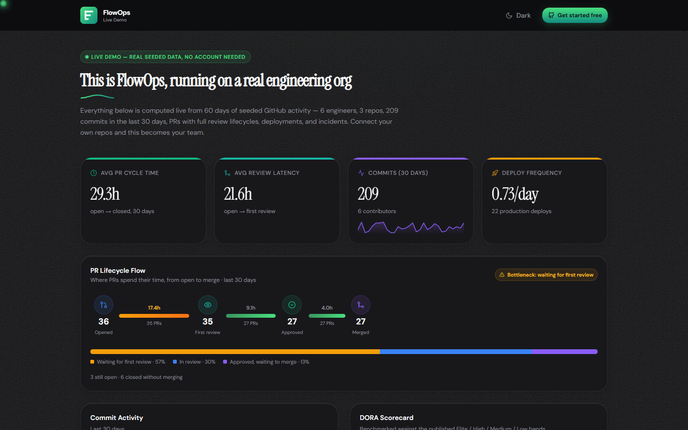
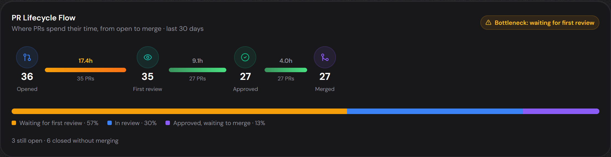
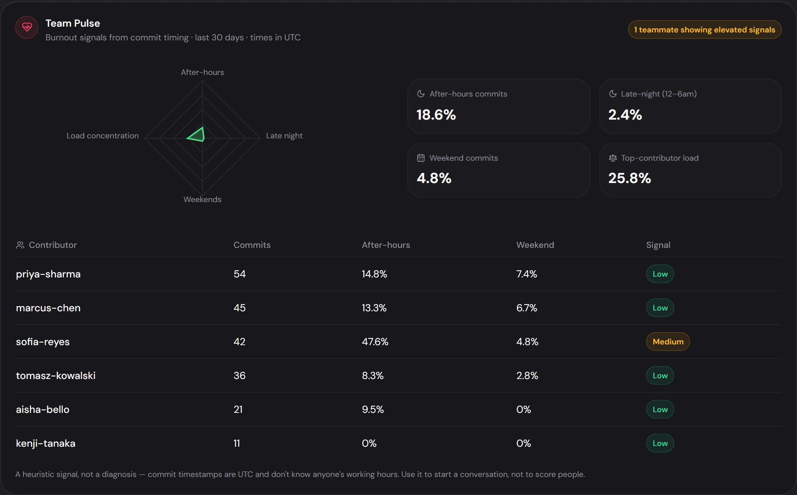
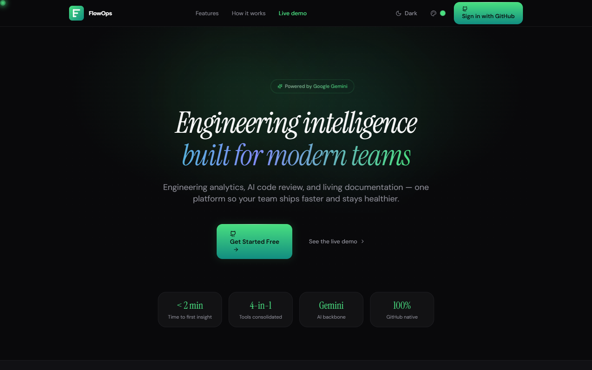

# FlowOps

[](LICENSE)
[](https://nodejs.org)

FlowOps is an AI-powered Engineering Intelligence SaaS platform for software teams to analyze, optimize, and improve development workflows based on GitHub activity and real-time metrics.

**Live demo:** visit `/demo` on any FlowOps deployment — a full, read-only tour on 60 days of real seeded data, no account needed.

## 👀 See it



**The PR Lifecycle Flow Map** — FlowOps' signature visual. Stage-by-stage timing from open to merge, with the bottleneck flagged automatically:



**Team Pulse** — burnout signals from commit timing (after-hours, late-night, weekends, load concentration), framed as a conversation starter, not a scorecard:



**The landing page:**



## 🚀 What FlowOps solves

- Consolidates commit, PR, review, and deployment events into a single analytics platform.
- Tracks cycle time, review latency, and engineering health.
- Detects bottlenecks and makes productivity insights actionable.

## 🧠 Implemented features (full SaaS scope)

### Core engineering intelligence

- GitHub OAuth authentication and session management
- GitHub webhook ingestion for commits, PRs, reviews, pushes
- PR tracking: open/merged/closed, cycle times, review status
- Commit analytics: velocity, churn (additions/deletions/changed files)
- Review latency metrics, DORA-style health metrics foundation
- Sprint health generation (delivery predictability, burnout risk)
- Leaderboard and personal productivity dashboard
- PR Lifecycle Flow Map: stage-by-stage view of where PRs spend time (open → first review → approval → merge) with bottleneck detection
- Team Pulse burnout radar: after-hours / late-night / weekend commit signals and workload concentration per contributor
- DORA "Where You Stand" benchmark badges (Elite/High/Medium/Low) and a what-if simulator projecting cycle-time gains from faster reviews

### Organization & access management

- Multi-tenant org model with `organization`, `organization_member`, `repository`
- RBAC: owner/admin/member/viewer roles
- Invite flow: invite, accept, cancel, list invites
- Org repository connect/disconnect (with GitHub webhook lifecycle)

### User and profile

- User profiles with username, e-mail, avatar, preferred mode (personal/org)
- Public profile endpoints, personal metrics, contribution heatmaps
- Onboarding status, welcome flow, and per-user mode switching

### AI features

- AI code review: trigger via PR or GitHub path
- AI review results: security issues, performance hints, anti-patterns, refactor suggestions, score
- AI-generated documentation pipeline: repo exploration, content extraction, markdown generation
- AI Help Assistant: Gemini-powered in-app chat widget with page-context awareness, markdown-formatted answers, suggested questions per page, and proactive idle tips
- AI Insights page: "State of Engineering" narrative reports written from real org metrics, plus one-click AI standup summaries (last 24h per person, paste-ready for Slack)

### Automation & notifications

- PR automation engine: stale PR nudges, unassigned-reviewer nudges, auto-approval of low-risk PRs
- Weekly impact digest emails summarizing team activity
- Slack notification delivery and `/flowops` slash-command support
- In-app notification preferences (email/push/stateful settings)

### Team communication (org mode)

- **In-app 1:1 chat** between org teammates — floating chat widget, live delivery over an authenticated Socket.IO connection, persisted message history, unread badges. Message a teammate directly from the Team page.
- **Send email to a teammate** — one-off compose action (subject/body) from the Team page, delivered via the existing email pipeline to the teammate's FlowOps account email.
- **Schedule Google Meet** — from a repo's Contributors list on the Team page, opens a prefilled Google Calendar event (with a Meet link) addressed to the contributors' FlowOps account emails, so it works regardless of whether they use Gmail, Outlook, etc.
- Socket connections are authenticated at the WebSocket handshake (session JWT via cookie) and room joins are membership-checked server-side, so notifications/chat can't be read by spoofing another user's or org's ID.

### SaaS & governance features

- Billing with Razorpay: plan checkout, subscription lifecycle, payment verification, webhook handling
- Usage tracking: organization usage summary, history, quota meters
- API keys for automation and service-to-service auth
- Audit logs of events, actions, and data changes
- Compliance tools: export org data, delete org data, configure retention policy
- Changelog management (CRUD + seeded release history)
- Review rules: custom thresholds, automation support

### Productivity utilities

- Achievements and gamification checks
- Code snippets management (create/update/delete/favorite)
- Personal tasks with stats dashboard
- Personal metrics with period-over-period trend indicators (vs. the previous equivalent time window)

### Personal mode: Discover

- Type a topic you want to learn or build (e.g. "RAG chatbot") and get back relevant GitHub repositories (sorted by stars) and dev.to articles.
- Query expansion via Gemini (when `GEMINI_API_KEY` is configured) turns a free-text topic into a GitHub search query and dev.to tags; falls back to naive keyword extraction if no key is set, so the feature works either way.
- No dev.to API key required — uses dev.to's public read-only API.

### Miscellaneous

- Health check endpoint (`/health`)
- Public report sharing endpoint with rate-limited access
- Authenticated WebSocket event support for real-time updates (commits, PRs, reviews, notifications, chat), including a live activity ticker on the dashboard
- Metric cards with inline sparklines and animated count-ups
- First-run spotlight product tour on the dashboard

## 📦 Repositories

- `flowops-api/`: Express backend, Prisma ORM, PostgreSQL, webhook handling, metrics APIs.
- `flowops-web/`: Next.js frontend (App Router), Tailwind CSS, UI screens for dashboards, org/team settings, reporting.

---

## ⚙️ Local setup

### Prerequisites

- Node.js >= 18
- npm or pnpm
- PostgreSQL >= 14
- GitHub app (client ID/secret) + webhook URL (e.g. via `ngrok`)

### 1. Clone repo

```bash
git clone https://github.com/vedantDube/FlowOps.git
cd FlowOps
```

### 2. Backend setup (`flowops-api`)

```bash
cd flowops-api
cp .env.example .env
# Update .env with:
# DATABASE_URL, GITHUB_CLIENT_ID, GITHUB_CLIENT_SECRET, GITHUB_WEBHOOK_SECRET, JWT_SECRET
# Optional: PORT (default 4000), FRONTEND_URL, APP_URL, LOG_LEVEL, JWT_EXPIRY,
# ENCRYPTION_KEY, GEMINI_API_KEY, RAZORPAY_*, SMTP_* (see below), SLACK_*
npm install
npx prisma migrate dev --name init
npx prisma generate
npm run dev
```

**Notes on optional env vars:**
- `ENCRYPTION_KEY` — 64 hex chars, generate with `node -e "console.log(require('crypto').randomBytes(32).toString('hex'))"`. Required in production to encrypt stored secrets (e.g. API keys, Slack tokens).
- `GEMINI_API_KEY` — required for AI code review, AutoDocs, and the AI Help Assistant chat widget.
- `SMTP_*` — required for digest emails and notification delivery. Gmail's SMTP is not reliable for production sending; a transactional provider (e.g. Brevo) is recommended. Use port `587` locally; some cloud hosts (e.g. Render) block outbound `587`, in which case use port `2525` instead.
- `APP_URL` — the backend's own public URL (used in generated links, e.g. invite emails). Defaults to `http://localhost:4000` locally.

### 3. Frontend setup (`flowops-web`)

```bash
cd ../flowops-web
cp .env.example .env
# Update .env with FRONTEND_URL (usually http://localhost:3000) and NEXT_PUBLIC_API_URL (e.g. http://localhost:4000)
npm install
npm run dev
```

### Optional: demo data

To see every dashboard populated without connecting a real repo, log in once via GitHub, then run:

```bash
cd flowops-api
npm run db:seed:demo            # attaches a "FlowOps Demo" org to the first user
npm run db:seed:demo <username> # or to a specific GitHub username
```

This seeds 60 days of realistic commits, PRs, reviews, deployments, incidents, and AI reviews. Re-running wipes and regenerates the demo org. Switch to "FlowOps Demo" in the org switcher.

### 4. Webhooks

- Run `npx ngrok http 3000` (or whichever port your API uses)
- Configure GitHub webhook URL: `https://<ngrok-id>.ngrok.io/webhooks/github`

---

## ☁️ Production deployment

FlowOps is designed to run as two separately deployed services on different domains (e.g. backend on Render, frontend on Vercel):

- **Backend (`flowops-api`)**: containerized via `Dockerfile.api`. The container's start command runs `npx prisma migrate deploy` before starting the server — `npx prisma generate` alone (run at build time) only regenerates client types and does **not** apply pending migrations to the database.
- **Frontend (`flowops-web`)**: containerized via `Dockerfile.web`, or deployed directly to Vercel.
- **Cross-domain cookies**: since the frontend and backend live on different domains, the auth cookie must be set with `sameSite: "none"` and `secure: true` in production. Note that Next.js middleware running on the frontend domain cannot read a cookie set by a different backend domain — route protection is enforced client-side per page instead (checking the real `/auth/me` response), not via middleware.
- Set `NODE_ENV=production` and `APP_URL`/`FRONTEND_URL` to the deployed public URLs so generated links (invites, emails) point to the right place.

---

## 🧩 Architecture

- `flowops-api/src/`: auth, controllers, services, middleware, routes
- `prisma/schema.prisma`: data models for users, orgs, repos, events, PRs, reviews, metrics
- `flowops-web/app/`: Next.js pages, components, dashboard analytics
- `flowops-web/components/`: shared UI elements

## 🔐 Authentication & Authorization

- GitHub OAuth login redirect flow in `flowops-api/src/auth/github.auth.js`
- API key support for internal service-to-service access in `api-keys.controller`
- RBAC checks in `flowops-api/src/middleware/rbac.middleware.js`

## 📊 Metrics pipeline

- Webhooks saved in events tables
- Background or on-demand metric population from controllers and services
- Reports, review rules, SaaS usage, and leaderboard endpoints available

---

## 🧪 Testing

Run tests in each workspace (if tests exist):

```bash
cd flowops-api && npm test
cd flowops-web && npm test
```

## 🐛 Troubleshooting

- Clear DB and rerun migration: `npx prisma migrate reset`
- Inspect webhook delivery in GitHub App dashboard
- Check logs: `flowops-api` prints webhook and auth events

---

## 🔗 Getting started as dev

1. Create GitHub OAuth App
2. Seed first user via GitHub login
3. Add org/repo via UI
4. Trigger webhook events via test GitHub commits/PRs
5. Review analytics dashboard and metrics cards

---

## 🧍‍♂️ Contributing

- Fork main
- Create feature branch `feature/<desc>`
- Follow PR template and code style (prettier + eslint)
- Add tests for controllers/services

---

## 🌟 Roadmap (key planned enhancements)

- enterprise policy & advanced team metrics
- DORA metrics dashboard (lead time, MTTR, deployment frequency)
- MS Teams alerting
- jira / ci tool integrations
- AI-suggested code review review patterns

---

## 📚 Links

- API docs: `flowops-api/src/controllers` (Swagger if added)
- UI walkthrough: `flowops-web/app/*`
- DB schema: `flowops-api/prisma/schema.prisma`

---
